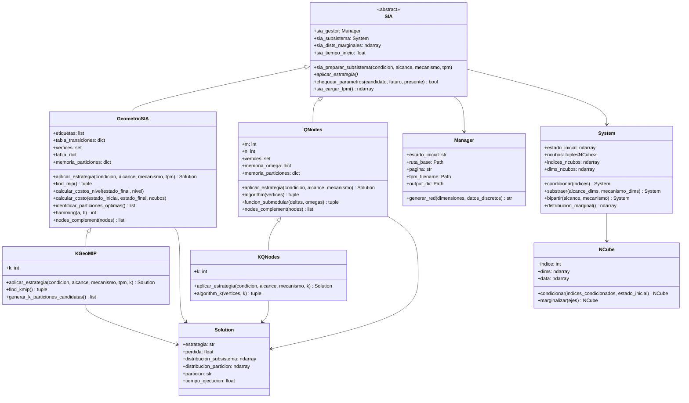
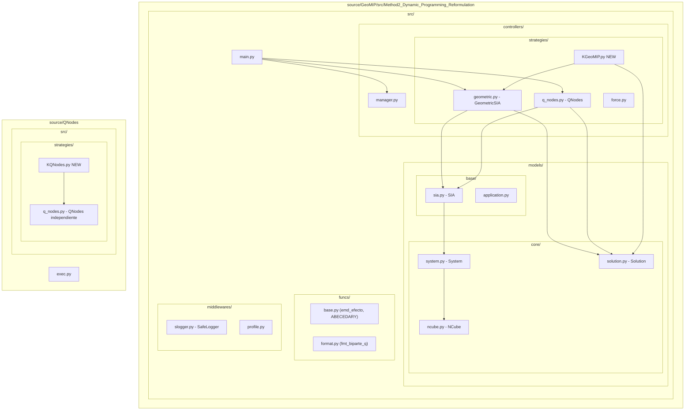
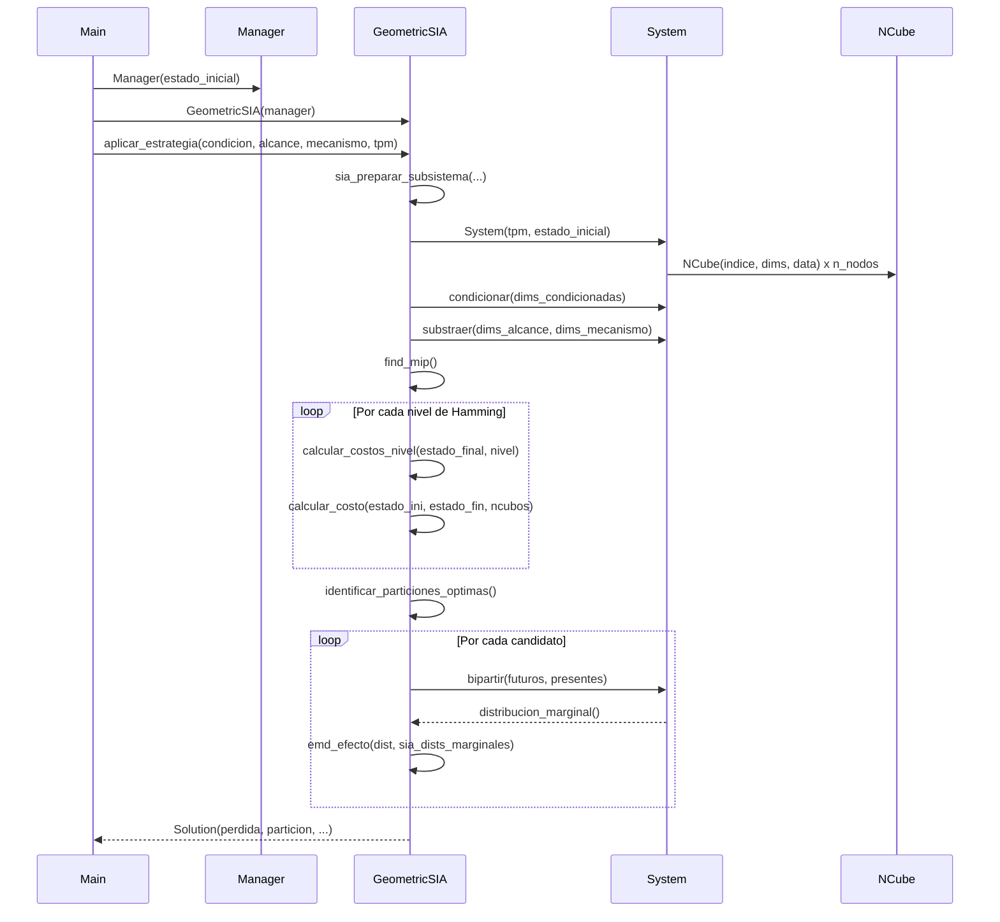
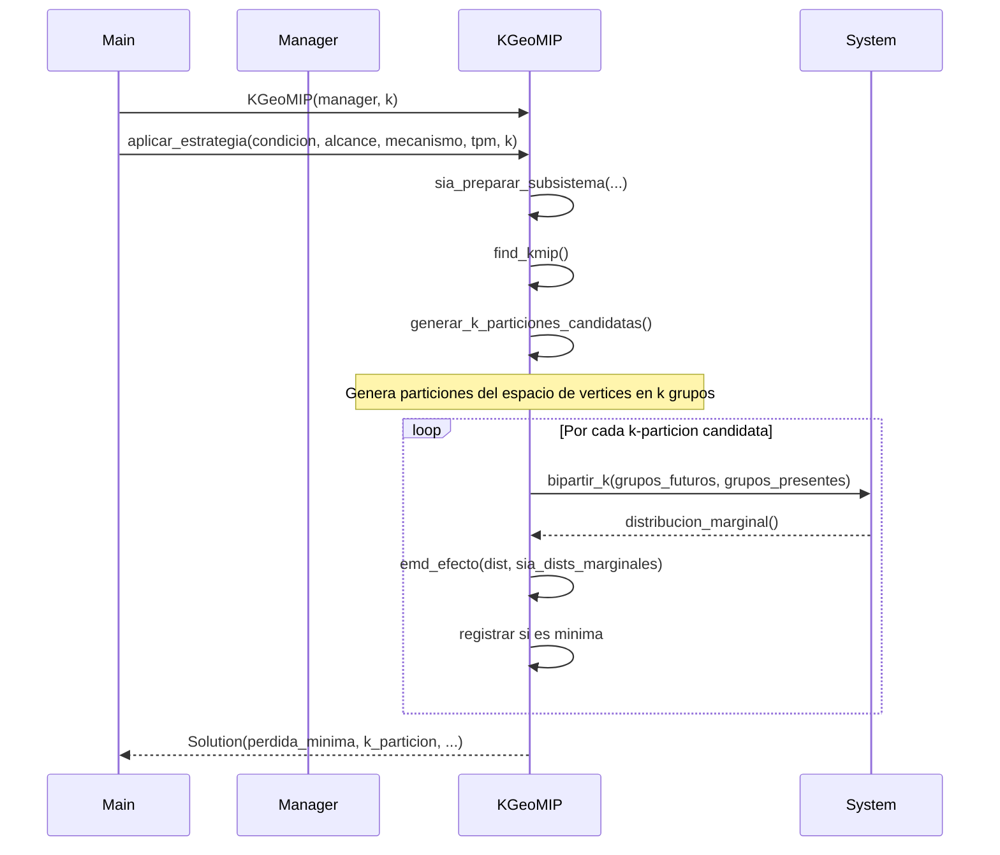

<!-- Desde arquitectura actual del sistema, diagramas mencionados, optimalidad del sistema -->

## Arquitectura actual del sistema

El sistema sigue un patrón **Template Method** combinado con **Strategy**:

- `SIA` (clase abstracta) define el flujo de preparación del subsistema en `sia_preparar_subsistema` y declara el contrato `aplicar_estrategia`.
- `GeometricSIA` y `QNodes` concretan `aplicar_estrategia` con sus respectivos algoritmos.
- `System` encapsula todas las operaciones algebraicas sobre la TPM (condicionar, substraer, bipartir, distribucion_marginal).
- `NCube` representa cada nodo como un hipercubo n-dimensional con operaciones de marginalización y condicionamiento.
- `Manager` resuelve la ruta de la TPM y expone el directorio de salida.
- `Solution` formatea y presenta el resultado (incluyendo síntesis de voz opcional).

### Diagrama de clases (Mermaid)

### Diagrama de paquetes (Mermaid)

### Diagrama de secuencia — Búsqueda de MIP (GeoMIP actual)

### Diagrama de secuencia — Extensión a k-particiones (KGeoMIP propuesto)

## Optimalidad del sistema

### GeoMIP

- Explora el hipercubo de estados entre `estado_inicial` y `estado_final` por niveles de distancia Hamming, calculando el costo de transición `tx(i,j) = (1/2^dh) * (|X[i]-X[j]| + sum(tx(k,j)))`.
- Identifica candidatos en cada nivel y evalúa la EMD sólo para los más prometedores.
- **Fortaleza:** evita exploración combinatoria completa al guiarse por la topología del hipercubo.
- **Limitación actual:** genera únicamente biparticiones (k=2).

### QNodes

- Aplica el algoritmo de Queyranne adaptado: construye incrementalmente un conjunto `omega` eligiendo en cada paso el `delta` que minimiza la diferencia `EMD(omega ∪ delta) - EMD(delta)`.
- Usa memoización de EMDs individuales (`memoria_delta`) para evitar recálculos.
- **Fortaleza:** garantías teóricas de submodularidad para biparticiones.
- **Limitación actual:** ídem, sólo biparticiones.
