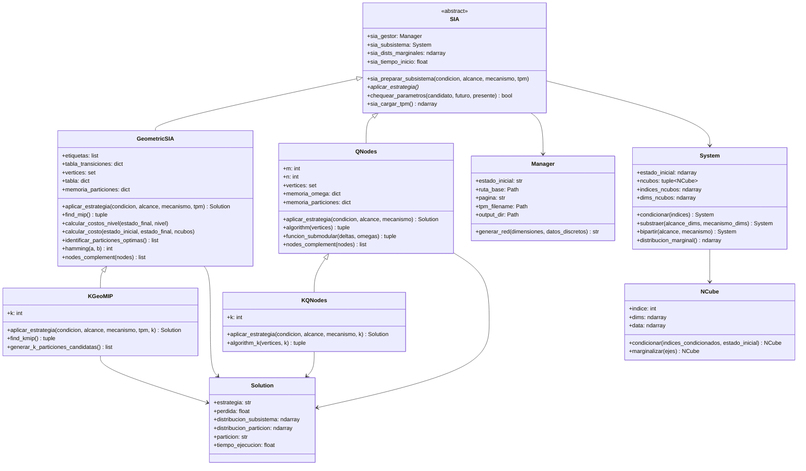
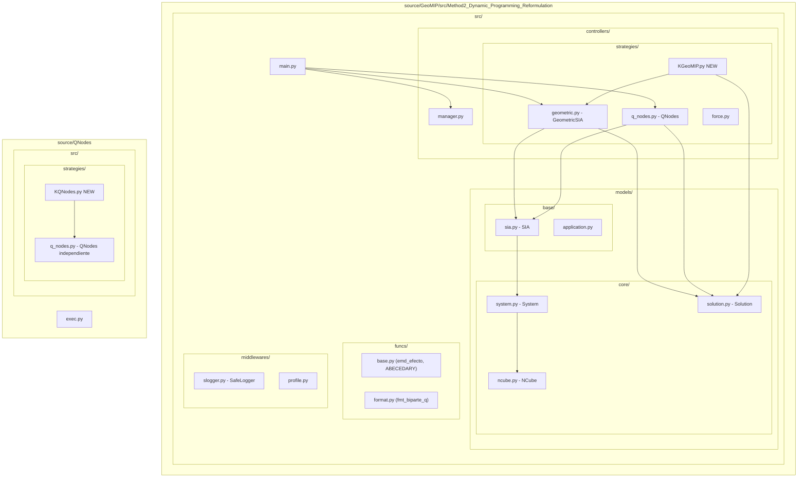
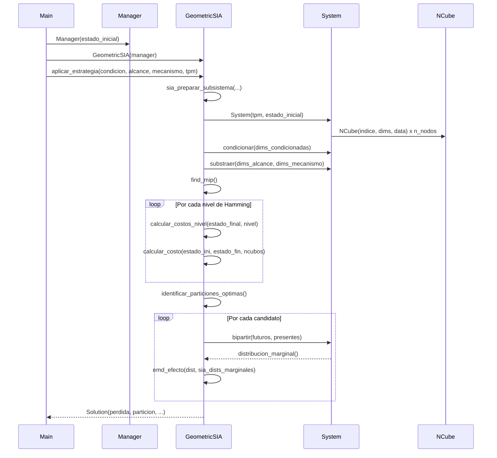
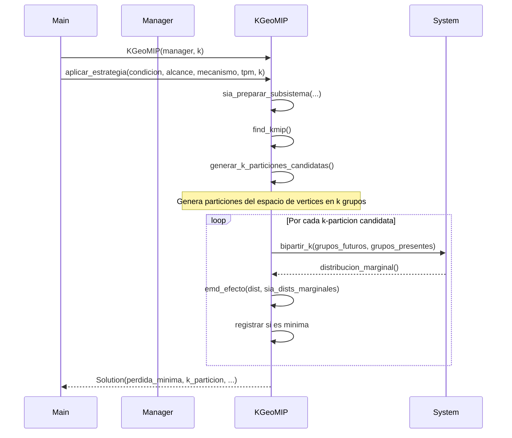

# CONSTITUCION

<!-- Reglas que voy a manejar (Ficheros, principios de software y calidad) -->

## Principios de software

- **Single Responsibility:** Cada clase tiene una única razón de cambio. `SIA` prepara subsistemas; `GeometricSIA` / `QNodes` aplican la estrategia; `System` modela el sistema; `NCube` modela el n-cubo; `Manager` gestiona la carga de datos; `Solution` representa y presenta el resultado.
- **Open/Closed:** La jerarquía `SIA → GeometricSIA / QNodes` permite añadir nuevas estrategias sin modificar la infraestructura existente.
- **Herencia sobre duplicación:** `KGeoMIP` y `KQNodes` heredarán de sus respectivas clases base, reutilizando `sia_preparar_subsistema`, `bipartir`, `distribucion_marginal`, etc.
- **Convenciones de nombrado:** Repositorios y carpetas se nombran `KGeoMIP` y `KQNodes` (prefijo `K` = k-particiones).
- **Idioma del código:** Español para atributos de dominio de IIT; inglés sólo en identificadores de librerías externas.
- **Calidad de logs:** Usar `SafeLogger` en cada estrategia; nunca `print` en producción.
- **Calidad de Codigo:** Maxima número de lineas de codigo: 300.

## Ficheros clave

| Fichero | Rol |
|---|---|
| `source/GeoMIP/src/Method2.../src/models/base/sia.py` | Clase base abstracta de toda estrategia |
| `source/GeoMIP/src/Method2.../src/controllers/strategies/geometric.py` | Estrategia GeoMIP (bipartición geométrica) |
| `source/GeoMIP/src/Method2.../src/controllers/strategies/q_nodes.py` | Estrategia QNodes (Queyranne, GeoMIP side) |
| `source/QNodes/src/strategies/q_nodes.py` | Estrategia QNodes (implementación independiente) |
| `source/GeoMIP/src/Method2.../src/models/core/system.py` | Operaciones de condicionado, substracción, bipartición |
| `source/GeoMIP/src/Method2.../src/models/core/ncube.py` | N-cubo: condicionar y marginalizar |
| `source/GeoMIP/src/Method2.../src/models/core/solution.py` | Presentación del resultado |
| `source/GeoMIP/src/Method2.../src/controllers/manager.py` | Carga de TPM y configuración de rutas |

---

# CLARIFICACION

<!-- Preguntas que hay acerca del proyecto y como resolverlo -->

## Contextualización

En el contexto de la IIT4.0 se trabaja el concepto de la MIP (Minimal Information Partition), esta lo que nos dice es que existe una forma de partir un sistema de forma tal que su coste asociado sea mínimo.

Este proyecto busca resolver este problema mediante dos heurísticas denominadas como:

- Queyranne: Se basa en el principio de resolver grupos optimos de biparticiones y al final tomar la mejor opcion combinada.
- Geométrica: Se basa en que la topología de la TPM puede ser expresada como un hipercubo donde el numero de variables futuras son el numero de ncubos y el número de variables presentes el numero de dimensiones que maneja cada hipercubo.

Hay implementaciones pensadas para resolver el problema a nivel de biparticiones:

- [Queyranne](/source/QNodes/exec.py)
- [Geometric](/source/GeoMIP/src/Method2_Dynamic_Programming_Reformulation/exec.py)

Al ejecutarse `uv run ../exec.py` se generan una serie de documentos .xlsx guardados en:

- [Queyranne](source/QNodes/.docs/.strategies/qnodes/EjemploQNodesV1.xlsx)
- [Geometric](por definir > por ahora ejecuta una única prueba)

## Metodológia de desarrollo

A partir de las estrategias ya existentes, se busca diseñar algoritmos similares dentro de su respectivo directorio para trabajar con k-particiones.

La forma de validar que el resultado obtenido es correcto es mediante la pérdida obtenida; cálculada mediante la distancia-métrica usada (EMD) aplicada entre la distribución de probabilidad del subsistema y el subsistema reconstruído tras ser partido, esta debe ser mínima (optimo global).

Se ejecutan las pruebas desde la fuente de la verdad y los resultados deben ser coincidentes:

- Las biparticiones pueden ser distintas
- La pérdida debe ser el mínima

## Compilación documental

A partir de la comparativa de resultados se espera analizar el algoritmo viejo que genera 2-particiones y el nuevo que trabaja k-particiones.

Se plantea analizar:

- tiempos de compilación por cada prueba
- Biparticiones obtenidas

1. Se harán gráficas comparando cada prueba realizada.
2. Se describe por medio de diagramas mermaid el funcionamiento de cada estrategia vieja y nueva.
   - Diagrama de clases
   - Diagrama de paquetes
   - Diagrama de secuencia
   - Patrones utilizados

### Compilación latex

A partir de las graficas obtenidas se adicionan al documento [técnico](/document/tecnico.tex) en su respectiva [sección](/document/sections/tecnico).

---

1. Hay que ejecutar las estrategias Q-nodes y GeoMIP con la biparticiones utilizando las pruebas del excel.

2. Una vez ejecutadas dichas pruebas hay que adaptar el proyectos para que estas estrategias funciones con K particiones

3. Una vez implementado se vuelven a ejecutar las pruebas del excel con las K particiones

4. Documentar el proceso

- Crear manual de usuario
- Crear manual Tecnico

---

- Dos paradigmas geometrico, q-nodes aplicando multriprocesing
- Pruebas a partir de los excel

---

# SYSTEM DESIGN

<!-- Desde arquitectura actual del sistema, diagramas mencionados, optimalidad del sistema -->

## Arquitectura actual del sistema

El sistema sigue un patrón **Template Method** combinado con **Strategy**:

- `SIA` (clase abstracta) define el flujo de preparación del subsistema en `sia_preparar_subsistema` y declara el contrato `aplicar_estrategia`.
- `GeometricSIA` y `QNodes` concretan `aplicar_estrategia` con sus respectivos algoritmos.
- `System` encapsula todas las operaciones algebraicas sobre la TPM (condicionar, substraer, bipartir, distribucion_marginal).
- `NCube` representa cada nodo como un hipercubo n-dimensional con operaciones de marginalización y condicionamiento.
- `Manager` resuelve la ruta de la TPM y expone el directorio de salida.
- `Solution` formatea y presenta el resultado (incluyendo síntesis de voz opcional).

### Diagrama de clases (Mermaid)



### Diagrama de paquetes (Mermaid)



### Diagrama de secuencia — Búsqueda de MIP (GeoMIP actual)



### Diagrama de secuencia — Extensión a k-particiones (KGeoMIP propuesto)



## Optimalidad del sistema

### GeoMIP
- Explora el hipercubo de estados entre `estado_inicial` y `estado_final` por niveles de distancia Hamming, calculando el costo de transición `tx(i,j) = (1/2^dh) * (|X[i]-X[j]| + sum(tx(k,j)))`.
- Identifica candidatos en cada nivel y evalúa la EMD sólo para los más prometedores.
- **Fortaleza:** evita exploración combinatoria completa al guiarse por la topología del hipercubo.
- **Limitación actual:** genera únicamente biparticiones (k=2).

### QNodes
- Aplica el algoritmo de Queyranne adaptado: construye incrementalmente un conjunto `omega` eligiendo en cada paso el `delta` que minimiza la diferencia `EMD(omega ∪ delta) - EMD(delta)`.
- Usa memoización de EMDs individuales (`memoria_delta`) para evitar recálculos.
- **Fortaleza:** garantías teóricas de submodularidad para biparticiones.
- **Limitación actual:** ídem, sólo biparticiones.

---

# PLANEACION

<!-- Serie de pasos especifico para la implementacion -->

## Pasos de implementación

### Fase 0 — Fuente de la verdad y baseline

1. **Coordinar la fuente de la verdad:** Unificar la lectura del archivo Excel de pruebas (`Pruebas_Metodo2.xlsx`) para ambas estrategias con la misma función `ejecutar_desde_excel`.
2. **Ejecutar GeoMIP con biparticiones** sobre todas las filas del Excel y guardar `resultados_Geometric.xlsx`.
3. **Ejecutar QNodes con biparticiones** sobre las mismas filas y guardar `resultados_QNodes.xlsx`.
4. **Verificar consistencia:** la pérdida (`phi`) de ambas estrategias debe coincidir (las particiones pueden diferir).
5. **Generar CSVs comparativos** con columnas: `Iteración, Alcance, Mecanismo, Pérdida_Geo, Pérdida_Q, Tiempo_Geo, Tiempo_Q`.

### Fase 1 — Extensión KGeoMIP

6. Crear `source/GeoMIP/src/Method2.../src/controllers/strategies/kgeomip.py` con clase `KGeoMIP(GeometricSIA)`.
7. Agregar parámetro `k: int` en `aplicar_estrategia`.
8. Implementar `generar_k_particiones_candidatas()`: dado el conjunto de vértices `V`, generar particiones de `V` en exactamente `k` partes no vacías guiadas por la heurística geométrica (números de Stirling de segundo tipo como cota del espacio de búsqueda).
9. Adaptar `find_kmip()` para iterar sobre `k` grupos en lugar de dos.
10. Validar que para `k=2` el resultado coincide con `GeometricSIA`.

### Fase 2 — Extensión KQNodes

11. Crear `source/QNodes/src/strategies/kqnodes.py` con clase `KQNodes(QNodes)`.
12. Extender `algorithm` para que en lugar de formar un único par candidato por fase, forme `k` grupos mediante `k-1` cortes sucesivos del proceso de Queyranne.
13. Validar para `k=2`.

### Fase 3 — Experimentación y resultados

14. Ejecutar `KGeoMIP` y `KQNodes` con `k ∈ {2, 3, 4, 5}` sobre el mismo Excel.
15. Generar tablas de tiempos y pérdidas por `(n, k)`.
16. Graficar: tiempo vs. n (por k fijo), tiempo vs. k (por n fijo), pérdida vs. k.

### Fase 4 — Documentación

17. Completar `document/tecnico.tex` con las secciones del lineamiento (2.1–2.9).
18. Insertar gráficas generadas y diagramas Mermaid exportados como PNG/PDF.
19. Redactar análisis de complejidad formal.

<!--
TODOS:
1. Coordinar una fuente de la verdad para ambas estrategias.
2. Que se generen los CSVs que para compararlos
3. Implementar KGeoMIP.py
4. Implementar KQNodes.py
5. Validar k=2 contra baseline
6. Ejecutar experimentos k>2
7. Completar tecnico.tex
-->

---

# TDD

<!-- Serie de objetivos, validaciones, pruebas unitarias que permiten automatizar el proceso -->

## Objetivos de validación

### TV-01 — Consistencia baseline biparticiones
**Precondición:** GeoMIP y QNodes ejecutados sobre el mismo subsistema.  
**Criterio:** `|perdida_geo - perdida_q| < 1e-4` para cada fila del Excel.  
**Herramienta:** pytest + pandas.

```python
def test_consistencia_baseline(resultados_geo, resultados_q):
    for i, (pG, pQ) in enumerate(zip(resultados_geo["Pérdida"], resultados_q["Pérdida"])):
        assert abs(float(pG) - float(pQ)) < 1e-4, f"Fila {i}: geo={pG} vs q={pQ}"
```

### TV-02 — KGeoMIP == GeoMIP cuando k=2
**Criterio:** La pérdida de `KGeoMIP(k=2)` debe ser igual a la de `GeometricSIA` dentro de tolerancia `1e-6`.

```python
def test_kgeomip_k2_igual_geomip(sistema_pequeno):
    condicion, alcance, mecanismo, tpm = sistema_pequeno
    manager = Manager("100")
    geo = GeometricSIA(manager).aplicar_estrategia(condicion, alcance, mecanismo, tpm)
    kgeo = KGeoMIP(manager, k=2).aplicar_estrategia(condicion, alcance, mecanismo, tpm)
    assert abs(geo.perdida - kgeo.perdida) < 1e-6
```

### TV-03 — KQNodes == QNodes cuando k=2
**Criterio:** Análogo al TV-02 para la estrategia QNodes.

```python
def test_kqnodes_k2_igual_qnodes(sistema_pequeno):
    condicion, alcance, mecanismo = sistema_pequeno
    manager = Manager("100")
    q = QNodes(manager).aplicar_estrategia(condicion, alcance, mecanismo)
    kq = KQNodes(manager, k=2).aplicar_estrategia(condicion, alcance, mecanismo)
    assert abs(q.perdida - kq.perdida) < 1e-6
```

### TV-04 — Pérdida k-MIP <= pérdida 2-MIP
**Criterio:** Al aumentar k, la pérdida no puede crecer (más libertad de partición implica pérdida menor o igual).

```python
def test_perdida_decrece_con_k(sistema_pequeno):
    tpm, condicion, alcance, mecanismo = sistema_pequeno
    manager = Manager("1000")
    perdidas = []
    for k in range(2, 5):
        sol = KGeoMIP(manager, k=k).aplicar_estrategia(condicion, alcance, mecanismo, tpm)
        perdidas.append(sol.perdida)
    for i in range(len(perdidas) - 1):
        assert perdidas[i] >= perdidas[i+1] - 1e-6, f"Pérdida subió en k={i+3}"
```

### TV-05 — NCube: marginalizar es conmutativo
**Criterio:** `ncubo.marginalizar([a,b]) == ncubo.marginalizar([a]).marginalizar([b])`.

```python
def test_marginalizar_conmutativo(ncubo_3d):
    resultado_conjunto = ncubo_3d.marginalizar(np.array([0, 1], dtype=np.int8))
    resultado_secuencial = (
        ncubo_3d
        .marginalizar(np.array([0], dtype=np.int8))
        .marginalizar(np.array([1], dtype=np.int8))
    )
    np.testing.assert_allclose(resultado_conjunto.data, resultado_secuencial.data, atol=1e-6)
```

### TV-06 — System.bipartir conserva distribución marginal sin corte real
**Criterio:** Si todos los nodos quedan en el mismo grupo, la distribución marginal de la bipartición debe ser idéntica a la del subsistema original.

```python
def test_bipartir_sin_corte(subsistema_n3):
    todos_futuros = subsistema_n3.indices_ncubos
    todas_dims = subsistema_n3.dims_ncubos
    biparticion = subsistema_n3.bipartir(todos_futuros, todas_dims)
    np.testing.assert_allclose(
        biparticion.distribucion_marginal(),
        subsistema_n3.distribucion_marginal(),
        atol=1e-6,
    )
```

### TV-07 — Generación de k-particiones cubre todos los casos n=3, k=3
**Criterio:** Para n=3 variables y k=3 la función `generar_k_particiones_candidatas` debe retornar exactamente S(3,3)=1 partición = `{{a},{b},{c}}`.

```python
def test_numero_particiones_n3_k3(kgeomip_n3):
    particiones = kgeomip_n3.generar_k_particiones_candidatas(k=3)
    # S(3,3) = 1
    assert len(particiones) == 1
```

### TV-08 — Tiempo de ejecución registrado en Solution
**Criterio:** `solution.tiempo_ejecucion > 0` en toda ejecución.

```python
def test_tiempo_positivo(solucion_geo):
    assert solucion_geo.tiempo_ejecucion > 0
```

## Fixtures sugeridas

```python
# conftest.py
import numpy as np
import pytest
from src.controllers.manager import Manager
from src.models.core.ncube import NCube
from src.models.core.system import System

@pytest.fixture
def sistema_pequeno():
    """Sistema determinista N=3, estado inicial 100."""
    tpm = np.array([
        [0,0,1],[1,0,0],[0,1,0],[0,0,1],
        [1,1,0],[0,1,1],[1,0,0],[0,1,0]
    ], dtype=float)
    return tpm, "111", "111", "111"

@pytest.fixture
def ncubo_3d():
    data = np.random.rand(2, 2, 2)
    return NCube(indice=0, dims=np.array([0, 1, 2], dtype=np.int8), data=data)

@pytest.fixture
def subsistema_n3(sistema_pequeno):
    tpm, condicion, alcance, mecanismo = sistema_pequeno
    manager = Manager("100")
    from src.controllers.strategies.geometric import GeometricSIA
    geo = GeometricSIA(manager)
    geo.sia_preparar_subsistema(condicion, alcance, mecanismo, tpm)
    return geo.sia_subsistema
```
